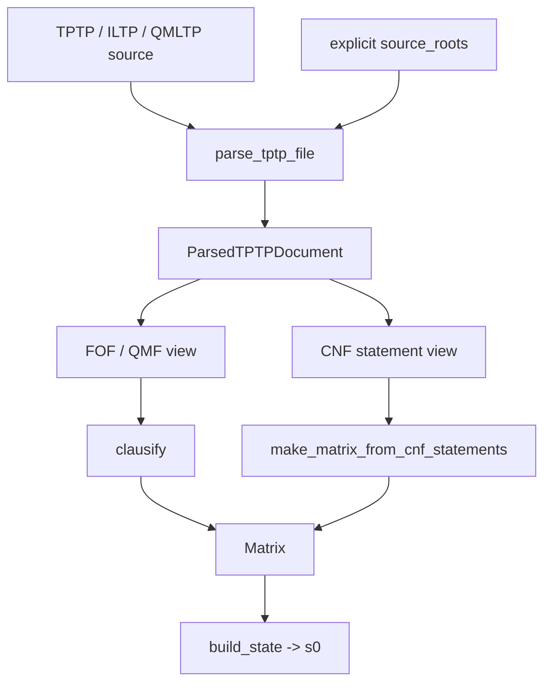

# Language

What a problem is, and how to read one. This is `syntax`, `parsing` and
`clausification` -- everything between a file on disk and the matrix *M* that
induces the transition system in [dynamics](dynamics.md).

## Three layers

    syntax          terms, literals, clauses, matrices
    parsing         TPTP text to statements and formulas
    clausification  formulas to a matrix

`syntax` is the bottom of the library. `parsing` produces its formula AST;
`clausification` consumes that AST and produces a `Matrix`. Nothing here knows
about tableaux, policies, or budgets.

## The formula IR

Parsing yields an AST of `Atom`, `Eq`, `Not`, `And`, `Or`, `Impl`, `Iff`,
`Forall`, `Exists`, over terms of `Variable` and `Function`. Modal input adds
`Box` and `Diamond` as first-class nodes rather than encoding them as ordinary
predicates, so a classical clausifier can reject them explicitly instead of
silently proving something else.

The IR is deliberately small. Formula annotations are kept as raw parsed objects
because proof search does not read them; what search needs is the matrix.

## Reading a file

`parse_tptp(text)` returns a `TptpFile` of `StmtFOF`, `StmtCNF`, `StmtQMF` and
`StmtInclude`. `parse_tptp_file(path, source_roots=...)` resolves includes and
returns a `ParsedTPTPDocument` carrying the selected statements, the resolved
includes, the include edges, and combined axiom, conjecture and problem
formulas.

Annotated forms outside that set -- `tff`, `thf`, `tcf`, `tpi` -- raise
`TPTPParseError` rather than being skipped, so an unsupported problem fails
loudly instead of being proved in a weaker language than it was written in.

**Include resolution takes no environment.** Includes are resolved from the
including file's directory and from explicit `source_roots`, and from nowhere
else. The parser does not read `TPTP`, `ILTP` or `QMLTP` environment variables.
Where a problem's axioms come from is part of the call, which is what makes a
run reproducible on a machine configured differently from the one that recorded
it.

## Two paths to a matrix

A first-order document goes through definitional clausification: negation normal
form with definitions introduced for shared subformulas, Skolemisation, then the
matrix. A document whose selected statements are all `StmtCNF` takes the direct
path, because reverse-engineering a formula from clauses and clausifying it
again would not round-trip.

Mixing the two in one document is rejected. The semantics of a half-clausified
problem is not obvious, and guessing at it silently is worse than refusing.

## What the matrix preserves

A `Matrix` is immutable and ordered: clause order, literal order within a
clause, and source roles all survive, because a leanCoP-style policy's choices
are defined relative to them. Two clausification settings therefore give two
different matrices, and by [running](running.md)'s vocabulary two different
transition systems.

It also carries derived indexes -- the connection graph, positive clauses,
conjecture clauses -- computed once and shared by every rollout in a schedule.

Fresh clause copies are not matrix data. They are introduced by rule
applications during search and belong to the state.

!!! note "One cycle today"

    `Matrix.complements` filters a literal's candidate connections by static
    unifiability, which reaches from `syntax` into `constraints` through a
    deferred import. Deciding which literals can connect is a calculus question,
    so the filter belongs above `syntax` rather than inside it.

## Roles and what they mean for SZS

CNF clauses with role `negated_conjecture`, and legacy `conjecture` clauses if
encountered, are marked as conjecture-role so that `start_clauses="conjecture"`
can prefer them. Marking a start preference is all it does.

It does not make the input a conjecture problem. An all-CNF input is a clause
set, so a closed tableau reports `Unsatisfiable` and an exhausted complete
search reports `Satisfiable` -- not `Theorem` and `CounterSatisfiable`. The
distinction is made here, at the point where the problem's shape is still
visible, and is carried into the result rather than re-derived later.

## Non-classical input

The supported modal surface matches the leanCoP-family reference translator:
`#box:A`, `#dia:A`, and indexed forms such as `#box(w):A`. Modal matrix
construction for `D`, `T`, `S4` and `S5` translates these into prefix-annotated
literals, and the prefixes become constraint data -- see
[constraints](constraints.md).

## The boundary above

`matrix_from_file` is the whole surface: a path and a source-resolution context
in, a matrix out. `build_state` wraps that matrix as *s₀*, and from there the
calculus takes over and never looks back at a file.
