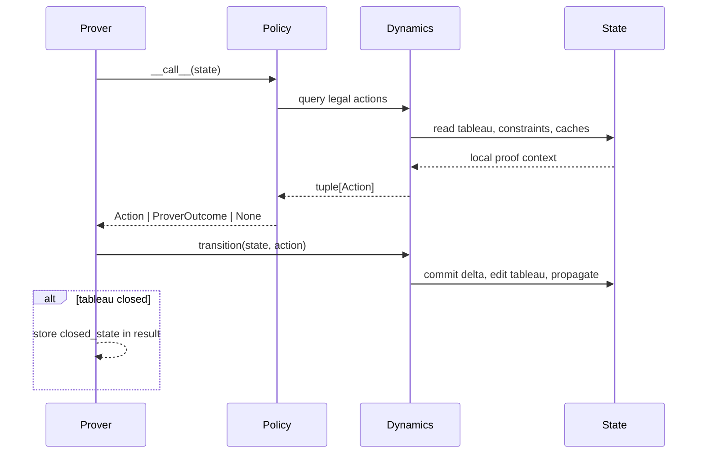

# State And Dynamics

`connections` separates proof-search state from action generation:

- `State` owns the mutable tableau, constraints, fringe, and fresh instance ids.
- `Dynamics` derives legal rule applications from a state and applies selected
  actions.
- `Policy` decides which available action to take.
- `Prover` runs the loop and records outcomes.

This keeps action choice at the policy boundary and keeps the transition system
reusable.

## Transition Loop



## Tableau State

`Tableau` stores:

- `TableauNode` objects keyed by stable `goal_id`
- `RuleApplication` objects keyed by `rule_application_id`
- the root goal id
- child addresses used for deterministic tree order

A tableau node can be:

- open with no applied rule
- expanded with an applied rule application
- closed because its applied rule has no children, or all children are closed

The root has no source literal. Start rules expand the root into the literals of
a selected start clause.

## Goal Identity

The prover uses integer `goal_id`s instead of object references as action
targets. This gives stable action data for policies, caches, traces, and
debugging. Addresses remain useful for tree order, but they are not the primary
action identity.

Clause variables are scoped by a fresh `instance_id` whenever a matrix clause is
selected. This lets the same clause be reused without sharing variables across
applications.

## Rules And Actions

The symbolic rule dataclasses are:

- `Start`
- `Extension`
- `Reduction`
- `Factorization`

Each rule carries a `ConstraintDelta`. The concrete action passed through the
policy/prover loop is either:

- `ApplyAction(goal_id, rule)`
- `UndoAction(step_id)`

`Dynamics.transition(state, action)` applies the selected action:

- `ApplyAction` calls `State.apply_rule`
- `UndoAction` calls `State.undo_rule_application`

The transition function assumes the policy selected an action from the current
action space.

## Constraint Transactions

`State` owns one `ConstraintStore`. Rules do not mutate the store while actions
are merely being generated. Instead, dynamics asks the store for a
`ConstraintDelta`:

```python
delta = state.constraints.delta_for_literals(...)
```

If the delta is `None`, the rule is not legal. If the rule is selected, the
state commits the delta under the new rule-application id:

```python
state.constraints.commit(delta, owner_app_id=rule_application_id)
```

Backtracking rolls back all deltas owned by removed rule applications. This is
the shared transaction boundary for:

- term bindings
- prefix equations
- active clause-instance free-variable references

Term constraints are solved eagerly. Prefix equations are accumulated and
checked for satisfiability under the selected logic/domain. Free-variable
admissibility is checked against the active references and any pending term
bindings.

## Action Generation

`Dynamics.apply_actions(state, goal, factorization=...)` returns grouped action
tuples:

1. `start`
2. `factorization`
3. `reduction`
4. `extension`

`ApplyActions.ordered()` concatenates them in that order.

For the root goal, only start actions are generated. For non-root goals,
dynamics generates factorization, reduction, and extension actions.

Regularity is checked before rule generation. If the current goal would violate
regularity, no actions are exposed for that goal.

## Path Indices

`State` maintains path indices on tableau nodes:

- `path_goal_ids_by_signed_symbol`
- `factorization_source_goal_ids_by_signed_symbol`

Reduction queries complementary literals on the current path. Factorization
queries already closed sibling goals from the current path segment.

When a rule is applied, child nodes inherit the current path index plus the
parent source literal. When closedness changes, factorization source indices are
refreshed for affected applications.

## Extension Cache

Each `TableauNode` has an extension cache. The cache key includes the
constraint-store revision and target literal. This avoids re-enumerating matrix
complements while still invalidating candidates when bindings, prefix equations,
or free-variable references change.

## Closedness And Backtracking

`Tableau.propagate_closedness_from(goal_id)` recomputes closedness upward:

- a goal with no applied rule is open
- a goal whose applied rule has no children is closed
- a goal whose applied rule has only closed children is closed

Backtracking removes a rule-application subtree, rolls back owned constraints,
removes deleted goals from the fringe, reinserts the reopened parent leaf, and
refreshes closedness.

## DFS Policy Frames

`DFSPolicy` is a policy, not part of dynamics. It restricts available actions by
maintaining frames:

```python
Frame.goal_id: int
Frame.actions: list[Action]
```

Work frames contain the remaining sibling goals at one AND level. Choicepoint
frames contain the remaining actions for one selected goal. `Dynamics` supplies
legal rule applications; DFS/ID restrict the order in which those legal actions
become visible. Concrete prover policies choose one visible action. If the
active branch exhausts its actions, DFS returns an `UndoAction` for the
appropriate earlier proof step.

`cut` removes remaining actions for closed goals. `scut` keeps only the first
root start action when applicable. `IDPolicy` extends DFS with
path-limit iteration and optional `comp(I)` behavior.

The action-space boundary is intentionally stricter than some reference-prover
trace bookkeeping. `Dynamics.apply_actions` produces only executable actions.
`IDPolicy` asks DFS for those legal actions, filters non-ground
extension actions that exceed the current path limit, and records
`pathlim_hit` markers in the same order as the remaining frame actions. Those
markers are emitted only when DFS reaches them: immediately before the selected
legal action, or when a frame exhausts with only blocked extension candidates
remaining. This preserves leanCoP-style classical trace ordering without
exposing illegal actions to policies.

The bundled non-classical Prolog references can still emit `pathlim_hit` at a
different granularity because they may trace internal extension candidates before
later prefix/domain or free-variable rejection. Those candidates are not native
policy-visible actions. Broad non-classical trace sweeps therefore use
`pathlim_hit` differences as diagnostics. The curated trace slice remains exact.

## Logic And Domain Boundary

`Problem.logic` and `Problem.domain` are passed into constraint checks by
dynamics. Classical ground-literal shortcuts are kept for performance. Any
non-classical candidate goes through the constraint store so prefix equations
and free-variable admissibility are enforced uniformly.

Supported native 0.1 constraint slices:

- classical term unification
- modal `D`, `T`, `S4`, and `S5` prefix unification
- intuitionistic prefix unification
- constant, cumulative, and varying-domain free-variable admissibility

## Extension Boundary

Extensions should compose with this state/dynamics layer rather than replace it:

- use a policy to choose among actions
- call a policy with `policy(state)` rather than applying actions directly
- use `ProverResult.closed_state` when the closed tableau is needed

The state/dynamics layer does not know about downstream output formats or
external orchestration.
