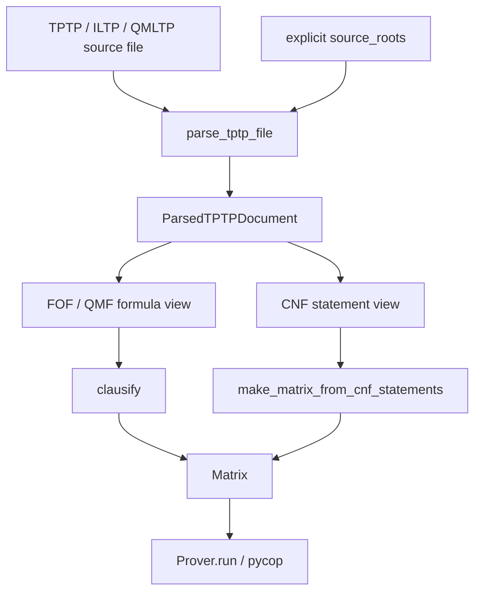

# TPTP Parser

`connections.parsing.tptp` is the native parser boundary for TPTP-like input.
It parses source files into a small formula IR and preserves statement-level
metadata needed by matrix construction and parity tooling.

## Supported Statements

The parser currently accepts:

- `fof(Name, Role, Formula, ...)`
- `cnf(Name, Role, Clause, ...)`
- `qmf(Name, Role, Formula, ...)`
- `include(File, ...)`

Unsupported annotated forms such as `tff`, `thf`, `tcf`, and `tpi` still raise
`TPTPParseError` with the existing top-level or included-file error code. Those
error-code names still mention non-FOF for compatibility, even though `cnf` and
`qmf` are now accepted parser inputs.

Includes are resolved only from the including file's directory and explicit
`source_roots`; the parser does not implicitly read `TPTP`, `ILTP`, or `QMLTP`
environment variables.

## Source To Matrix

## FOF

FOF statements are parsed into the core formula AST:

- `Atom`
- `Eq`
- `Not`
- `And`
- `Or`
- `Impl`
- `Iff`
- `Forall`
- `Exists`

Terms are represented by `Variable` and `Function`. Formula annotations are
kept as raw parsed objects for now; proof search does not depend on them.

## CNF

CNF statements are first-class formula statements represented by `StmtCNF`.
A CNF clause is parsed into the same formula AST:

- `p(a)` becomes `Atom("p", ...)`
- `~p(a)` becomes `Not(Atom("p", ...))`
- `X = a` becomes `Eq(X, a)`
- `X != a` becomes `Not(Eq(X, a))`
- `p(a) | ~q(a)` becomes an `Or` tree

Variables in CNF clauses are left as variables in the AST. A direct
clause-to-`Matrix` path is available for documents whose selected formula
statements are all `StmtCNF`. `negated_conjecture` clauses, and legacy
`conjecture` clauses if encountered, are marked as conjecture-role clauses in
the matrix so `start_clauses="conjecture"` can prefer them. They do not make
the source problem a conjecture problem for SZS reporting: all-CNF inputs are
reported as clause-set satisfiability problems, so a closed tableau maps to
`Unsatisfiable` and an exhausted complete search maps to `Satisfiable`. Other
CNF roles are treated as axiom clauses. Mixed CNF and non-CNF matrix
construction is intentionally rejected until that boundary has a clear
semantics.

## QMF

QMF statements are represented by `StmtQMF`. The supported modal surface slice
matches the leanCoP-family reference translator:

- `#box:A`
- `#dia:A`
- indexed forms such as `#box(w):A` and `#dia(w):A`

Modal operators are parsed as `Box` and `Diamond` AST nodes, not encoded as
ordinary predicates. Classical clausification still rejects modal AST nodes
explicitly; modal matrix construction for `D`, `T`, `S4`, and `S5` translates
them into prefix-annotated literals.

## Document Shape

`parse_tptp(text)` returns a `TptpFile` containing `StmtFOF`, `StmtCNF`,
`StmtQMF`, and `StmtInclude` entries.

`parse_tptp_file(path, source_roots=...)` resolves includes and returns a
`ParsedTPTPDocument` with:

- `statements`: all selected formula statements
- `includes`: resolved include statements
- `include_edges`: parent/child include edges
- `axiom_formula`, `conjecture_formula`, and `problem_formula`: combined
  formulas for matrix construction

That combined formula view is useful for FOF clausification and the first
non-classical matrix-construction slice. Direct CNF matrix construction still
uses the statement-level representation rather than reverse-engineering syntax
from the combined formula.
